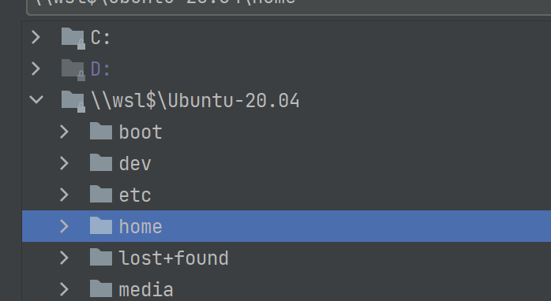
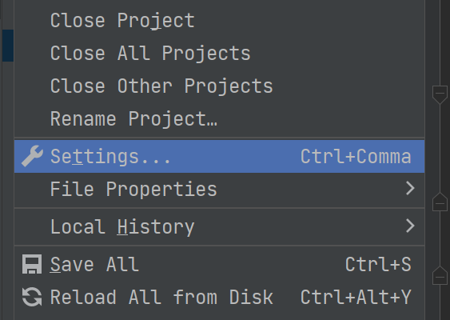
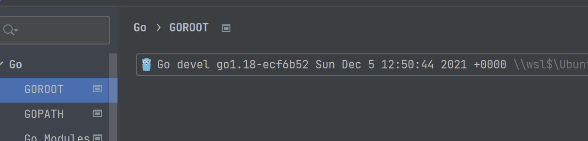
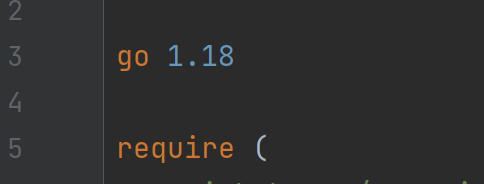

# 如何使用 WSL 和 gotip 来体验 Go 泛型

自从 Go 1.17 之后，就可以直接使用泛型了。但是 Go 1.17 其实支持并不完整，在实际使用的时候会遇到一些编译不通过，语法不支持之类奇怪的 BUG。所以在测试泛型的时候，我们依旧建议使用 gotip。

使用 gotip 还有一个好处，则是随时可以更新最新的代码，获得最新的特性和代码修复。

但是在 Windows 上使用 gotip 会稍微麻烦一点，因为 gotip 编译要求必须安装 gcc。

为了避免在编译过程出现一些奇怪的本地环境 BUG，我们也是建议在 WSL 上进行操作。

同时，目前 GoLand IDE 已经支持直接开发 WSL 上的项目了，所以目前来看，在 Windows 上最好的尝试泛型的组合就是 WSL + GoLand + gotip。

## 安装 gotip

安装 gotip 非常简单，但是要求先安装一个 Go 版本。如果本地已经有了 Go 环境，只需要执行命令：
```shell
go install golang.org/dl/gotip@latest
gotip install
```
`gotip`命令允许传入一个分支参数，一般只有在自己需要更新到特定分支，或者更新到特定的提交的时候才需要考虑。

## 打开 Go 项目

在安装完项目之后，可以在 WSL 内部创建一个 Go 项目，而后尝试用 GoLand 打开一个新项目：



直接在 GoLand 里面选择 WSL 目录下的项目就可以。

打开之后，要修改项目的设置，打开 GoLand 的设置：





在设置里面，将 GOROOT 导向 gotip 目录就可以了。

## 修改 go.mod
在这一步还没有完成，我们需要修改 go.mod 里面的 Go 版本：



## 写一个测试：
可以直接写一个简单的泛型方法来进行测试：
```go
func SayHello[T any](t T) string {
	return fmt.Sprintf("Hello, %v", t)
}
```
对应的单元测试是：
```go
func TestSayHello(t *testing.T) {
	str := SayHello("Tom")
	assert.Equal(t, "Hello, Tom", str)
	str = SayHello("Jerry")
	assert.Equal(t, "Hello, Jerry", str)
}
```
在 GoLand 里面直接运行该测试就可以了。
